
Datum:18.04.2024

Tags: #informatik 

---

# Sortieralgorithmen
#### Daten
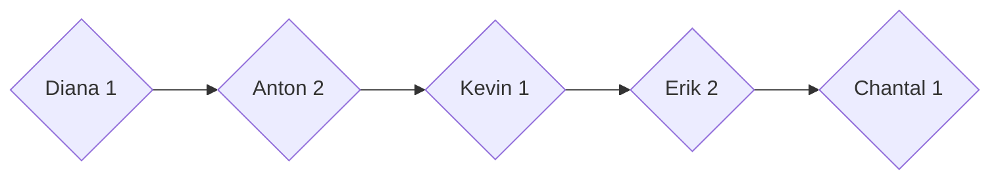

#### Alphabetisch sortiert mit Bubble sort

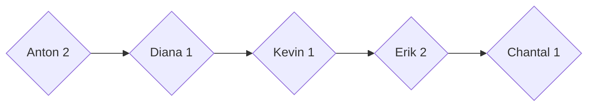

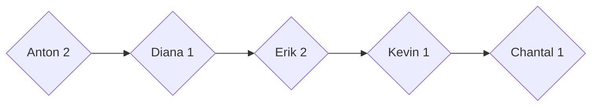

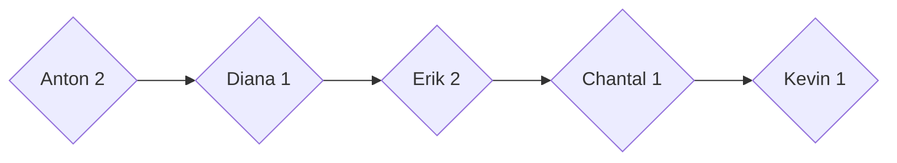

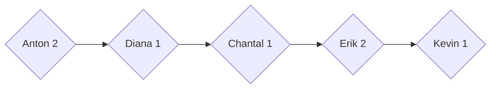

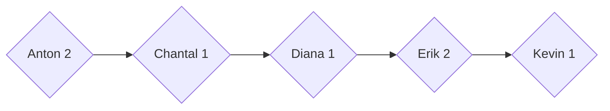

#### Bubble Sort nach Noten
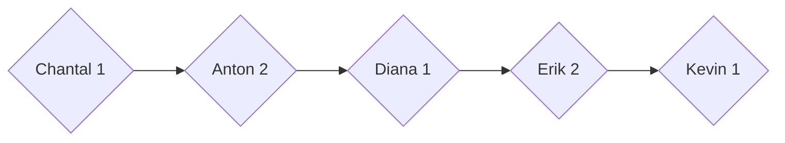

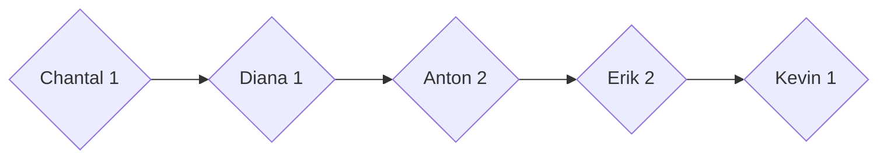

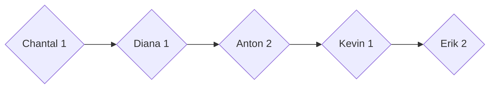

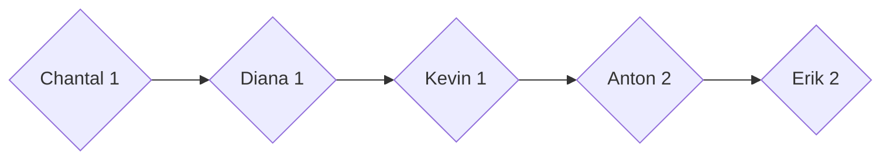

#### Quicksort nach Noten

Pivot: Anton 2
Lower
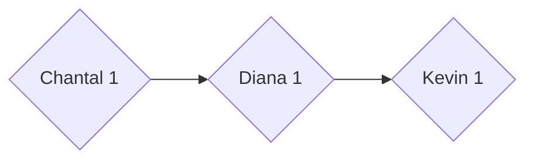
Higher
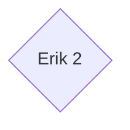
Pirvot: Chantal 1
Higher
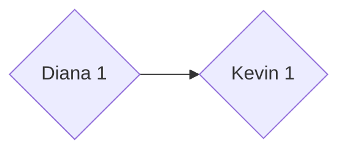
Lower
\-

Merged

Referenzergebniss:

#### Stabilität
Ein Algorithmus ist stabil wenn er ein auf seinen Input angewandtes Sortiertkriterium bei der Sortierung nach einem Neuen beibehält.