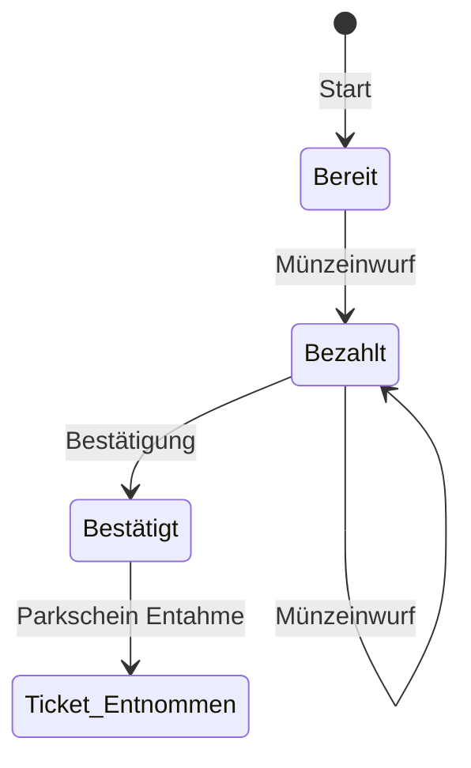
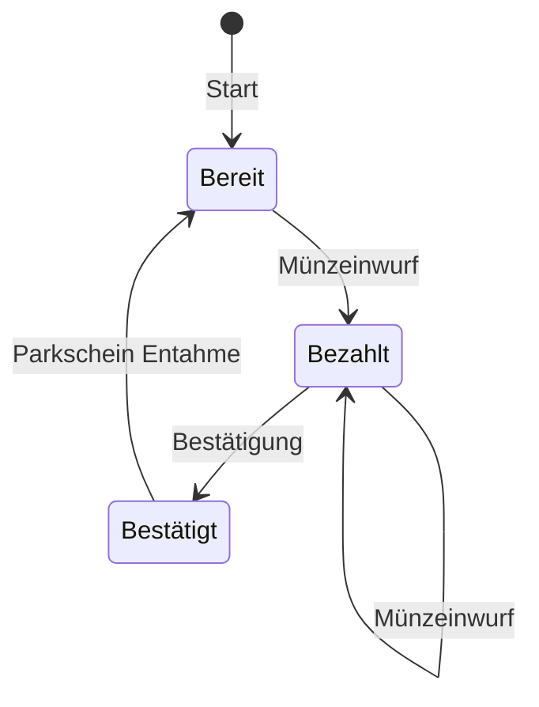
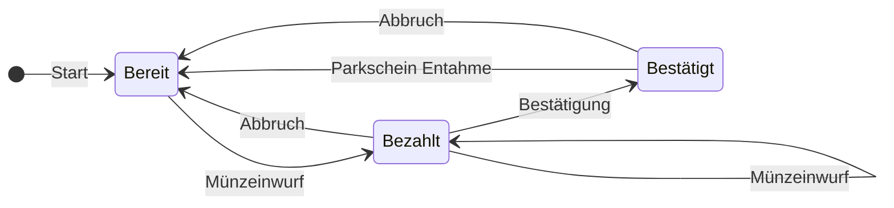
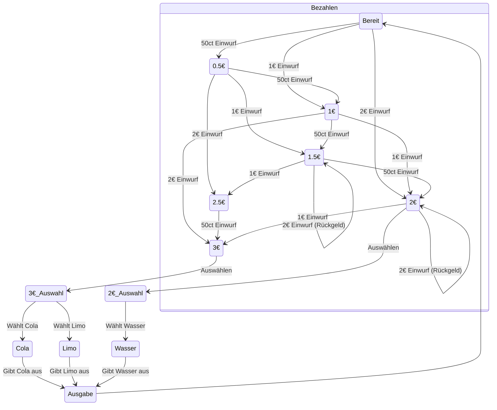
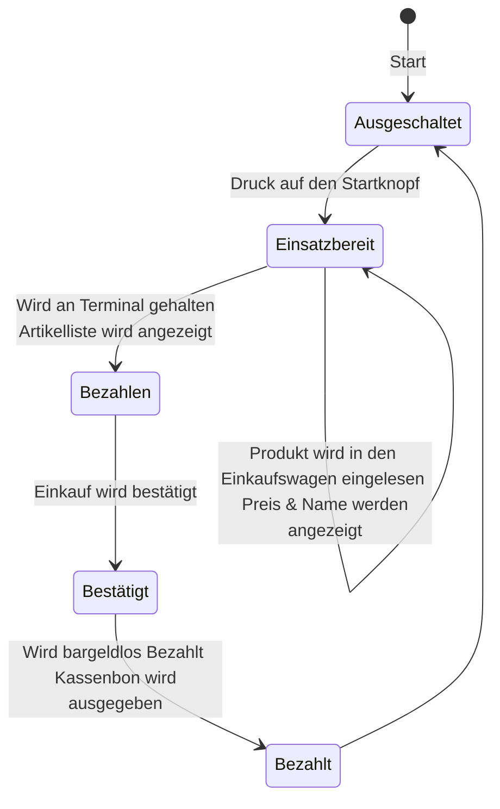

Datum:20.01.2025

Tags: #informatik 

---

# Automaten

#### Nr.1  Parkscheinautomat

**a+b:**

**c:**
Ja, da nach der Ticketentahme die einzig nächste Möglichkeit ein erneuter Bezahlprozess ist, kann auf den Letzten Zustand verzichtet werden und stattdessen der Erste wieder eingemonnen werden.

**d:**

**e:**
Die Relevanz überträgt sich, da dieses Modell ein abstraktes ist.

#### Nr.2 Getränkeautomat

a)

Zustand | Eingabe | Übergang | Effekt
:-:|:-:|:-:|:-:
Bereit|1€|1€
Bereit|2€|2€
1€|1€|2€
1€|2€|3€
2€|1€|3€
2€|2€|2€|2€ Rückgeld
3€|Auswählen|Auwahl|Menu Wechsel
Auswahl|Wähle Limo|Limo
Auswahl|Wähle Cola|Cola
Limo | Bestätigung | Ausgabe | Gibt Limo aus
Cola | Bestätigung | Ausgabe | Gibt Cola aus
Ausgabe | Getränk Entnommen | Bereit

b)

#### Nr 3

