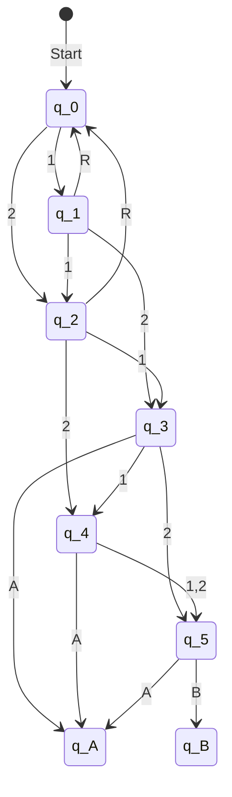

Datum:23.01.2025

Tags: #informatik 

---

# Deterministische endliche Automaten

#### Aufgabe 4 
> Beschreibe ob es sich um einen DEA handelt. Gib die formale Definition als 5-Tupel an.

**a)**
Ist kein deterministischer automat, weil der Zustand $q_1$ für das $w \in \Sigma | w = a$ 2 definierte Zustandsänderungen hat

 

**b)**
$A = (Q, q_0, F, \Sigma, \delta)$

Q = {$q_0,q_1,q_2$}
$q_0 = q_0$
$F = \{\}$
$\Sigma = \{a\}$

Q|a|
:-:|:-:
$q_0$|$q_1$
$q_1$|$q_2$
$q_2$|$q_1$

**c)**
$A = (Q, q_0, F, \Sigma, \delta)$

Q = {$q_0,q_1,q_2,q_3,q_4$}
$q_0 = q_0$
$F = \{q_2,q_3\}$
$\Sigma = \{0,1\}$

Q|0|1|
:-:|:-:|:-:
$q_0$|$q_1$|$q_2$
$q_1$|$q_3$|
$q_2$|$q_3$|
$q_3$|$q_4$|
$q_4$|$q_2$|$q_4$

#### Aufgabe 5 | Fahrscheinautomat

$A= \{Q,q_0,F,\Sigma,\delta\}$
Q = {$q_0,q_1,q_2,q_3$}
$q_0 = q_0$
$F = \{q_3\}$
$\Sigma = \{1,2,R\}$

$\delta =$

Q|1|2|R|
:-:|:-:|:-:|:-:|
$q_0$|$q_1$|$q_2$|
$q_1$|$q_1$|$q_3$|$q_0$
$q_2$|$q_3$|$q_3$|$q_0$
$q_3$|

**b)**

1. 12
2. 21
3. 22
4. 111

–
1. 1
2. 2R
3. 1R
4. 11

**c)**

#### Nr.6
$L(A) = \{w \in \Sigma^* | \hat\delta(q_0, w) \in F\}$

$A_1$
1100
11100
11100
111100

$L(A) = \{w \in \Sigma^* | w = (11(1 + 0)^*00)\}$

$A_2$
aba
bab
a
b

$L(A) = \{w \in \Sigma^* |$ w besteht aus beliebig langen sich abwechselnden Ketten von a oder b und muss mit dem gleichem Kettentyp enden in dem er anfängt}

#### Nr.7

**a)**
$\epsilon,01,00$

**b)**

# $L(A) = \{w \in \Sigma^* | w = (\epsilon + (((01)^*(00(10)^*)11))^*)(\epsilon|((((01)^*(00(10)^*)(\epsilon|11))))\}$

      
**c)**
$q_3$ -> Ungültige Eingabe

      

> vollständig (-er DEA) 
> Für jede eingabe des DEA ist ein zustandsübergang definiert