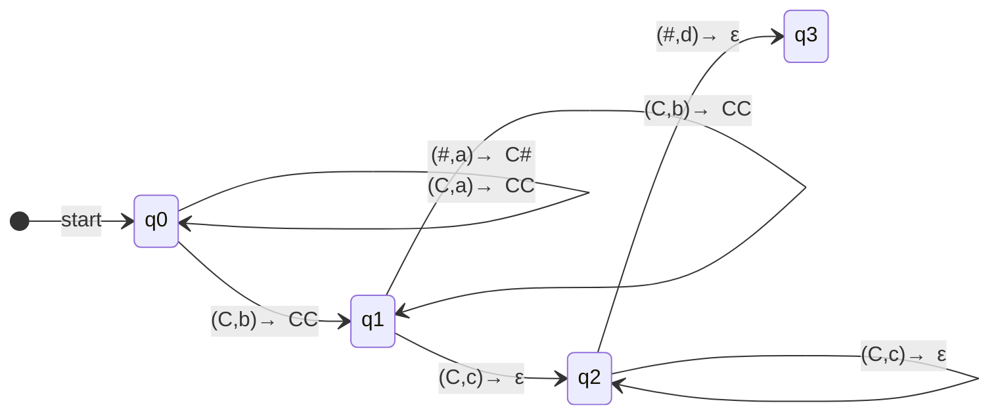

Datum:12.02.2025

Tags: #informatik 

---

# Kellerautomaten 2

#### Nr. 15 a)

$Q = \{q_0,q_1,q_2\}$
$F = {q_2}$
$\Sigma^*_\epsilon = \{0,1,x,\epsilon\}$
$\# = \{\#\}$
$q_0 = q_0$
$\Gamma = \{\#,1,0\}$

$\delta =$

Zustand | Eingabe | Keller | Zustand | Keller
:-:|:-:|:-:|:-:|:-:|
$q_0$|0|1|$q_0$|01
$q_0$|1|0|$q_0$|10
$q_0$|1|1|$q_0$|11
$q_0$|0|0|$q_0$|00
$q_0$|1|#|$q_0$|1#
$q_0$|0|#|$q_0$|0#
\-|
$q_0$|x|1|$q_1$|$\epsilon$
$q_0$|x|0|$q_1$|$\epsilon$
$q_0$|x|#|$q_1$|$\epsilon$
\-|
$q_1$|1|1|$q_1$|$\epsilon$
$q_1$|0|0|$q_1$|$\epsilon$
\-|
$q_1$|$\epsilon$|#|$q_2$|$\epsilon$

#### b)

q_0 baut einen string aus 0 und 1 in der Reihenfolge in der sie im Wort vorkommen
und geht mit x in q_1 über, wobei im x-Übergang schon das oberste entfernt wird

q_1 entfernt für eine jede 0 die oben liegende 0 und für jede 1 die oben liegende 1 und geht in q_2 über wenn der Kellerboden erreicht ist.

 $L(A) = \{w \in \Sigma^*_\epsilon  |  (1 | 0 )^nx(1 | 0 )^{n-1},  n \in \mathbb{N} \land n > 0\}$ 
 $L(A) = \{w \in \Sigma^*_\epsilon  |$  Eine beliebige Kette an 1 und 0 gefolgt von einem x gefolgt von der gleichen Kette ohne das letze element, umgedreht}

#### c) 
Nichts

#### Kellerautomaten Entwicklung

