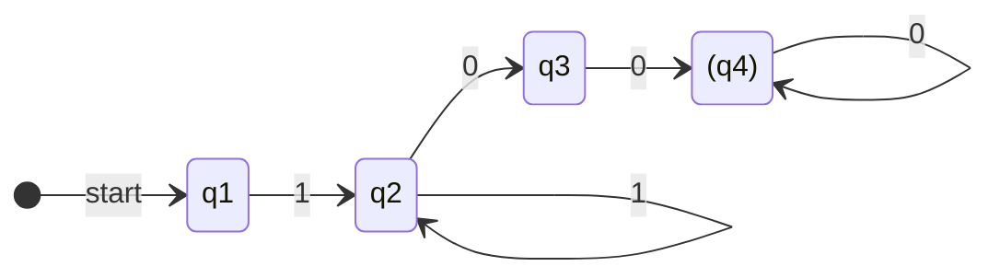
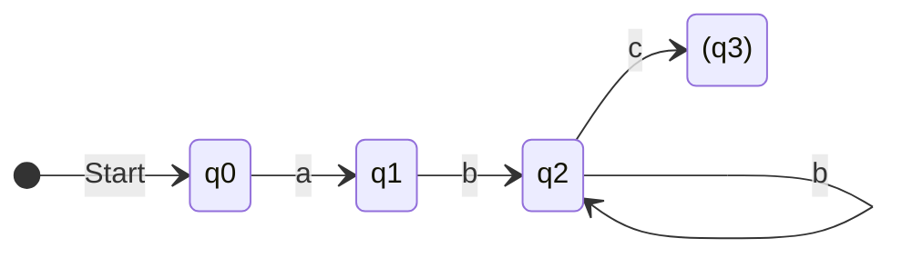

Datum:19.02.2025

Tags: #informatik 

---

# Formale Sprachen

#### Ableitungsfolge NR.1 a)
S→aA→abB→abaA→ababB→ababb

#### Wörter NR.1 b)
1. ab
2. aab
3. abb

##### Sprache NR.1 c)
$L(G) = \{w \in T | a(a|b)^nb , n \ge 1\}$

NR.2
#### Indentifizieren - 4-Tupel
$G = \{N,T,S,P\}$
$N = \{S,A,B\}$
$T = \{1,0\}$
$S = S$
![[Pasted image 20250220091628.png]]

#### Ableitbarkeit
1100 = S→1S→1A→0B→0
1110000 = S→1S→1S→1A→0B→0B→0B→0

#### Sprache

$L(G) = \{w \in T | 1^n0^m, n \ge 1, m  \ge 2\}$

#### DEA

#### NR.3 a)
1. 
$N = \{S,A,B\}$
$T = \{a,b,c\}$
$S = S$
2.
$N = \{S,A\}$
$T = \{a,b,c\}$
$S = S$

#### NR.3 b)
Beide Grammatiken sind Rechtsseitig, weil alle Nicht-Terminale auf der Linken Seite und alle Terminal/Nicht-Terminal Kombinationen auf der Rechten Seite Stehen.

Die Grammatik $G_2$ ist allerdings für eine Kontextfreiesprache, weil die rechte Seite einige der beliebigen Anordnungen an Terminalen und Nicht-Terminalen darstellt 

#### NR.3 c)

$L(G_1) = \{w \in T^* | ab^nc, n \ge 1\}$
$L(G_2) = \{w \in T^* | a^nb^mc^n, n,m \ge 1\}$

#### NR.3 d)

#### NR.5 

**a)**
$P = \{$
	S → 0A1 
	A → 0C1 | 01
	C → 0C | 1C | 0 | 1
}

$P = \{$
	S → 0A
	A → 0A | 0B 
	B → 1C
	C → 1C | 0C | 1
}

**b)**
$P = \{$
	S → 0A
	A → 0B | 0S
	B → 1C | 1
	C → 1B
}

**c)**
$P = \{$
	S → 0S | 1S | 0A
	A → 1B
	B → 1C
	C → 0D | E
	D → 1D | 0D | 0 | 1
	E → 0
}

**d)**
$P = \{$
S → $\epsilon$ | 1A
A → 1B
C → 1 | 1S
}

**e)**
$P = \{$
0-0 → a 1-0 | b 0-1 
1-0 → a 2-0 | b 1-1
2-0 → a 2-0 | b 2-1
0-1 → a 1-1 | b 0-2
1-1 → a 2-1 | b 1-2
2-1 → a 2-1 | b 2-2
0-2 → a 1-2 | b 0-2
1-2 → a 2-2 | b 1-2
2-2 → a 2-2 | b 2-2 | a | b
}
